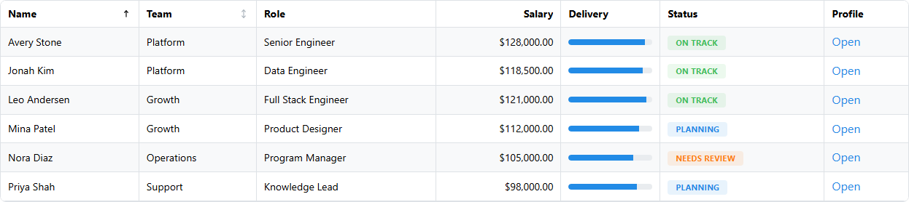

# dash-mantine-datatable

[](https://pypi.org/project/dash-mantine-datatable/)
[](LICENSE)
[](https://jeffgallini.github.io/dash-mantine-datatable/)
[](https://www.python.org/downloads/)

`dash-mantine-datatable` is a Dash wrapper around [Mantine DataTable](https://github.com/icflorescu/mantine-datatable) for apps that already use `dash-mantine-components`. It adds a Dash-friendly prop model, Mantine style props, component templates for renderers/editors/filters, and chainable Python helpers for columns, grouping, rows, selection, pagination, sorting, and search.



Read the full user guide and recipes on [GitHub Pages](https://jeffgallini.github.io/dash-mantine-datatable/).

## Install

```bash
pip install dash-mantine-datatable
```

Optional demo dependencies for the live gallery in `usage.py`:

```bash
pip install "dash-mantine-datatable[demo]"
```

## Quick start

```python
from dash import Dash
import dash_mantine_components as dmc
import dash_mantine_datatable as dmdt

app = Dash()

app.layout = dmc.MantineProvider(
    dmdt.DataTable(
        id="employees",
        data=[
            {"id": 1, "name": "Avery Stone", "team": "Platform", "status": "On Track"},
            {"id": 2, "name": "Mina Patel", "team": "Growth", "status": "Planning"},
        ],
        columns=[
            {"accessor": "name", "sortable": True},
            {"accessor": "team", "sortable": True},
            {"accessor": "status", "presentation": "badge"},
        ],
    ).update_layout(radius="lg", withTableBorder=True, striped=True)
)

if __name__ == "__main__":
    app.run(debug=True)
```

## Features

- Mantine-native styling via `radius`, `bg`, `classNames`, `styles`, and related props
- Fluent helpers: `update_layout()`, `update_table_properties()`, `update_columns()`, `group_columns()`, `update_rows()`, `update_selection()`, `update_pagination()`, `update_sorting()`, and `update_search()`
- Dash component slots for renderers, editors, filters, empty states, loaders, row expansion, and sort icons
- Client and server modes for pagination, sorting, and search
- Column filtering with Dash Mantine controls in header popovers
- Grouped headers, inline row grouping, nested child rows, and row expansion
- Checkbox selection with shift-range support, row dragging, inline editing, and callback payloads for row/cell interactions
- Generated Python, R, and Julia component packages from the same source tree

## Documentation

| Resource | Link |
| --- | --- |
| User guide + recipes | [jeffgallini.github.io/dash-mantine-datatable](https://jeffgallini.github.io/dash-mantine-datatable/) |
| Interactive demo app | `python usage.py` |
| API reference (local pdoc) | `python scripts/build_docs.py` |

Build the public docs site locally:

```bash
python -m pip install -e ".[demo]"
python scripts/build_great_docs.py
```

Regenerate recipe pages from `usage.py`:

```bash
python scripts/generate_recipes.py
```

Capture README/recipe screenshots from the running demo:

```bash
python usage.py
python scripts/capture_docs_media.py
```

## Helper example

```python
table = (
    dmdt.DataTable(
        data=[{"id": 1, "name": "Avery", "salary": 128000, "status": "On Track"}],
        columns=[
            dmdt.Column("name"),
            dmdt.Column("salary", textAlign="right", presentation="currency", currency="USD"),
            dmdt.Column("status", presentation="badge"),
        ],
    )
    .update_columns(selector="name", title="Employee")
    .update_rows(selector={"status": "On Track"}, className="row-ok")
    .update_selection(selectionTrigger="checkbox")
    .update_pagination(recordsPerPage=10)
)
```

## Compared with `dash-ag-grid`

| Area | `dash-mantine-datatable` | `dash-ag-grid` |
| --- | --- | --- |
| UI fit | Best when the app is already Mantine/DMC | Best when the grid is its own major product surface |
| Authoring model | Compact Dash API with Python helpers | Richer but more verbose AG Grid configuration |
| Dash component slots | Strong support for DMC renderers, editors, filters, and states | Strong custom rendering with a broader grid API |
| Common app-table features | Sorting, search, selection, pagination, expansion, dragging, grouped headers | Same core set plus spreadsheet-style tooling |
| Large-data strategy | Client/server pagination, sorting, and search | Additional row models and enterprise features |
| Best fit | Mantine-native Dash apps that want polished tables without AG Grid complexity | Data-heavy apps that need spreadsheet-grade grid mechanics |

## Local development

```bash
npm install --legacy-peer-deps
python -m pip install -r requirements.txt -r tests/requirements.txt
npm run build
python -m pytest
python usage.py
```

## Publishing

Preflight locally:

```powershell
.\scripts\check-release.ps1
```

```bash
python scripts/check_release.py
```

Release flow:

1. Land changes on `staging`.
2. Open a `staging -> main` PR titled `v1.0.0 Release - Stable feature set, docs site, and bug fixes`.
3. Merge to publish to PyPI, create the GitHub release, and deploy docs to GitHub Pages.

Required one-time setup:

- Protect `main` and require the Release PR Guard workflow.
- Configure GitHub Pages to publish from GitHub Actions.
- Add `PYPI_API_TOKEN` to the `pypi` environment.

See [CONTRIBUTING.md](CONTRIBUTING.md) and [CHANGELOG.md](CHANGELOG.md) for details.
