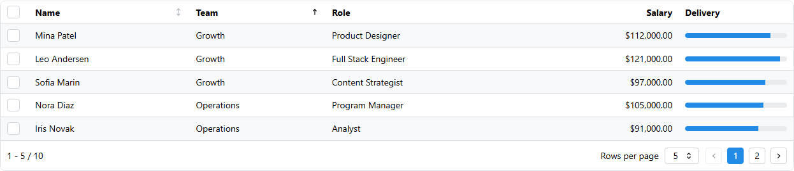

<!-- Generated by scripts/generate_recipes.py. Edit usage.py to change the code examples. -->

# Client-side Selection

Enable checkbox selection and read selected row IDs from a normal Dash callback prop.

Source: `usage.py::build_selection_code()`.



```python
table = dmdt.DataTable(
    id="selection-table",
    data=EMPLOYEES,
    columns=OVERVIEW_COLUMNS[:5],
    striped=True,
    selectionTrigger="checkbox",
    selectedRecordIds=[1, 3],
    paginationMode="client",
    page=1,
    recordsPerPage=5,
    pageSize=5,
    sortStatus={"columnAccessor": "team", "direction": "asc"},
)

@callback(
    Output("selection-output", "children"),
    Input("selection-table", "selectedRecordIds"),
)
def show_selected_rows(selected_ids):
    return f"Selected record ids: {selected_ids or []}"
```
