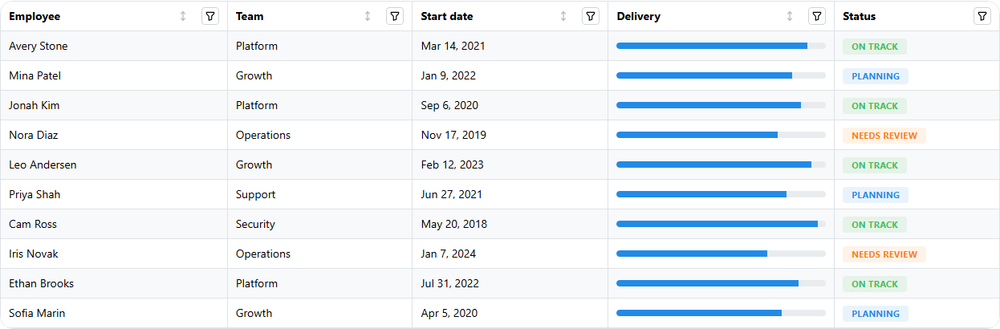

<!-- Generated by scripts/generate_recipes.py. Edit usage.py to change the code examples. -->

# Column Filtering

Render Dash filter controls in column popovers and combine them with table filter state.

Source: `usage.py::build_column_filtering_code()`.



```python
table = (
    dmdt.DataTable(
        id="column-filtering-table",
        data=EMPLOYEES,
        columns=COLUMN_FILTERING_BASE_COLUMNS,
        emptyState="No employees match the current filters.",
        filterMode="client",
        paginationMode="none",
    )
    .update_layout(
        radius="lg",
        withTableBorder=True,
        withColumnBorders=True,
        striped=True,
    )
    .update_columns(
        selector="name",
        width=220,
        filter=dmc.TextInput(
            id="column-name-filter",
            label="Employee",
            placeholder="Search employees...",
            value="",
        ),
    )
    .update_columns(
        selector="team",
        width=180,
        filter=dmc.MultiSelect(
            id="column-team-filter",
            label="Teams",
            data=COLUMN_FILTERING_TEAM_OPTIONS,
            value=[],
            comboboxProps={"withinPortal": False},
            searchable=True,
            clearable=True,
        ),
    )
    .update_columns(
        selector="startDate",
        width=190,
        filter=dmc.Stack(
            [
                dmc.DateInput(
                    id="column-start-date-from-filter",
                    label="Start date from",
                    value=None,
                    valueFormat="YYYY-MM-DD",
                    placeholder="Earliest date",
                    clearable=True,
                    popoverProps={"withinPortal": False},
                ),
                dmc.DateInput(
                    id="column-start-date-to-filter",
                    label="Start date to",
                    value=None,
                    valueFormat="YYYY-MM-DD",
                    placeholder="Latest date",
                    clearable=True,
                    popoverProps={"withinPortal": False},
                ),
            ],
            gap="xs",
        ),
        filterPopoverProps={"width": 320},
    )
    .update_columns(
        selector="deliveryScore",
        width=220,
        filter=dmc.Stack(
            [
                dmc.Text("Delivery score", fw=600, size="sm"),
                dmc.RangeSlider(
                    id="column-score-filter",
                    min=COLUMN_FILTERING_DEFAULT_SCORE_RANGE[0],
                    max=COLUMN_FILTERING_DEFAULT_SCORE_RANGE[1],
                    value=COLUMN_FILTERING_DEFAULT_SCORE_RANGE,
                    minRange=5,
                ),
            ],
            gap="xs",
        ),
        filterPopoverProps={"width": 320},
    )
    .update_columns(
        selector="status",
        width=160,
        filter=dmc.RadioGroup(
            id="column-status-filter",
            label="Status",
            value="all",
            children=dmc.Stack(
                [
                    dmc.Radio(label="All", value="all"),
                    dmc.Radio(label="On Track", value="On Track"),
                    dmc.Radio(label="Planning", value="Planning"),
                    dmc.Radio(label="Needs Review", value="Needs Review"),
                ],
                gap=6,
            ),
        ),
        filterPopoverProps={"width": 220},
    )
)
```
