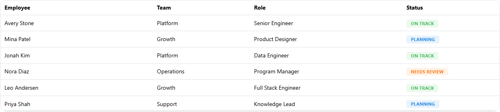

<!-- Generated by scripts/generate_recipes.py. Edit usage.py to change the code examples. -->

# Row Dragging

Enable Dash-native row reordering and inspect the emitted drag payload.

Source: `usage.py::build_row_dragging_code()`.



```python
table = (
    dmdt.DataTable(
        id="row-dragging-table",
        data=EMPLOYEES[:6],
        columns=ROW_DRAGGING_COLUMNS,
        paginationMode="none",
    )
    .update_layout(
        radius="lg",
        withTableBorder=True,
        height=280,
    )
    .update_rows(
        draggable=True,
    )
)
```
