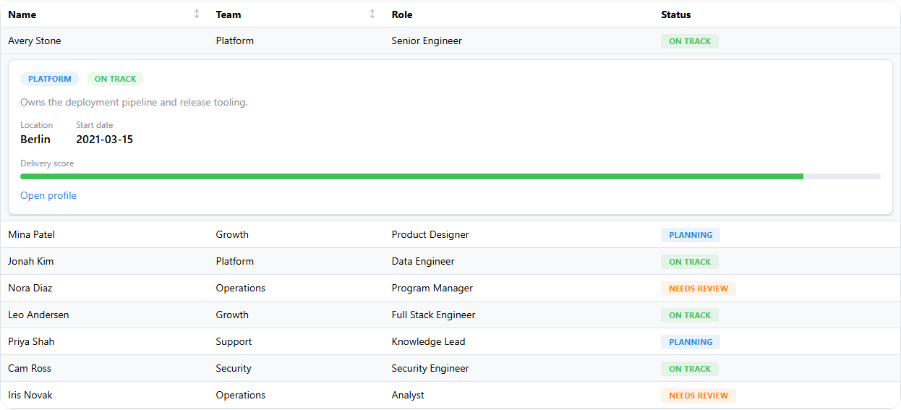

<!-- Generated by scripts/generate_recipes.py. Edit usage.py to change the code examples. -->

# Row Expansion

Attach expandable detail panels and inspect the expansion state emitted by the table.

Source: `usage.py::build_expanding_rows_code()`.



```python
table = (
    dmdt.DataTable(
        id="expanding-rows-table",
        data=EMPLOYEES[:8],
        columns=EXPANDING_ROWS_COLUMNS,
        paginationMode="none",
    )
    .update_layout(radius="lg", withTableBorder=True, striped=True)
    .update_rows(
        expandedRecordIds=[1],
        rowExpansion=dmdt.RowExpansionConfig(
            dmc.Paper(
                dmc.Stack([...]),
                p="md",
                radius="md",
                withBorder=True,
            ),
            allowMultiple=True,
        ),
    )
)
```
