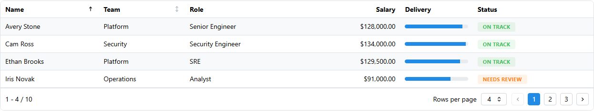

<!-- Generated by scripts/generate_recipes.py. Edit usage.py to change the code examples. -->

# Server Pagination and Sorting

Drive paging, sorting, and search from a callback that sends only the current slice of records.

Source: `usage.py::build_server_pagination_code()`.



```python
search = dmc.TextInput(id="server-search")

table = dmdt.DataTable(
    id="server-table",
    columns=OVERVIEW_COLUMNS[:6],
    paginationMode="server",
    sortMode="server",
    searchMode="server",
    page=1,
    recordsPerPage=4,
    sortStatus={"columnAccessor": "name", "direction": "asc"},
)

@callback(
    Output("server-table", "data"),
    Output("server-table", "totalRecords"),
    Output("server-table", "page"),
    Input("server-search", "value"),
    Input("server-table", "page"),
    Input("server-table", "recordsPerPage"),
    Input("server-table", "sortStatus"),
)
def update_server_table(search_value, page, records_per_page, sort_status):
    filtered = filter_and_sort(EMPLOYEES, search_value, sort_status)
    ...
```
